# Enterprise-Ready Agentic AI Architecture

**From prototype to production: a secure, end-to-end blueprint for agentic AI on Azure**

---

## What We Added

| Feature | Description |
|---------|-------------|
| ✅ End-to-end agentic AI reference architecture | Complete stack from MCP tools → Agent orchestration → Backend → Frontend |
| ✅ Enterprise security by default | VNet integration, private endpoints, zero-trust managed identity |
| ✅ No secrets, no public exposure | Internal MCP, RBAC everywhere, HTTPS ingress only |
| ✅ Production-ready automation | Terraform/Bicep IaC + GitHub Actions CI/CD with OIDC |

## Why It Matters

| Gap | Solution |
|-----|----------|
| ❗ Industry lacks clear guidance for enterprise-grade agentic AI | ✅ Repeatable, opinionated blueprint from Dev → Prod |

---

## Architecture Diagram

```mermaid
flowchart LR

    User["👤 Users"]
    
    subgraph VNET["🛡️ Enterprise VNet"]
        direction LR
        
        subgraph AGENTS["🤖 Agentic Layer"]
            FE["🌐 Frontend"]
            BE["⚙️ Agent Orchestrator"]
            MCP["🔧 MCP Tools"]
        end
        
        subgraph DATA["☁️ Azure Services"]
            AOAI["🧠 OpenAI"]
            COSMOS["💾 Cosmos DB"]
        end
        
        subgraph SEC["🔐 Zero Trust"]
            MI["🎫 Managed Identity"]
            CICD["🚀 CI/CD"]
        end
    end

    User -->|HTTPS| FE
    FE --> BE
    BE --> MCP
    BE --> AOAI
    MCP --> COSMOS
    
    MI -.-> BE
    MI -.-> MCP
    CICD -.-> AGENTS

    %% Styling
    classDef user fill:#1976D2,stroke:#0D47A1,stroke-width:3px,color:#fff
    classDef frontend fill:#43A047,stroke:#1B5E20,stroke-width:2px,color:#fff
    classDef agents fill:#FF9800,stroke:#E65100,stroke-width:2px,color:#000
    classDef data fill:#9C27B0,stroke:#4A148C,stroke-width:2px,color:#fff
    classDef security fill:#00ACC1,stroke:#006064,stroke-width:2px,color:#fff

    class User user
    class FE frontend
    class BE,MCP agents
    class AOAI,COSMOS data
    class MI,CICD security
```

