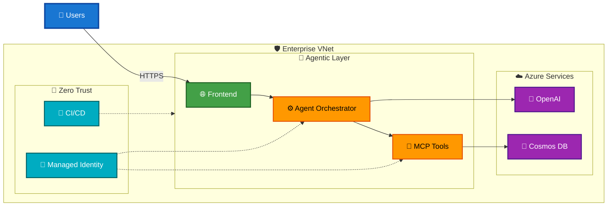

# Enterprise-Ready Agentic AI Infrastructure Workshop

**Build and deploy secure, end-to-end agentic AI solutions on Azure**

---

## Who Is This For

Infrastructure engineers and enterprise architects with in-depth Azure knowledge who need to deploy agentic AI in an enterprise-grade manner.

---

## What You'll Learn

- ✅ **End-to-end agentic architecture** — MCP tools → Agent orchestration → Backend → Frontend
- ✅ **Your choice of IaC** — Bicep or Terraform, manual scripts or GitHub Actions
- ✅ **Modern identity principles** — OIDC for GitHub Actions, Managed Identity for Azure services (no keys)
- ✅ **Network isolation** — VNet with private endpoints, only frontend exposed to internet
- ✅ **Enterprise-ready template** — Scalable, reusable blueprint for standalone or landing zone deployment

---

## Why It Matters

Most agentic AI samples stop at proof-of-concept — public endpoints, API keys, no network isolation. This workshop provides a **repeatable, production-ready blueprint** from Dev → Prod.

---

## Architecture Diagram

